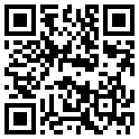
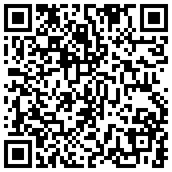

<script>
    function copyToClipboard(elementId) {
      var element = document.getElementById(elementId);
      var text = element.innerText;
      navigator.clipboard.writeText(text).then(function() {
        console.log('Copying to clipboard was successful!');
        alert("Copied to clipboard!");
      }, function(err) {
        console.error('Could not copy text: ', err);
      });
    }
</script>


## Support my work

If you find this package useful, please consider supporting my work with a cryptocurrency donation.

### Bitcoin

<div class="crypto-address">
  <span id="bitcoin-address">bc1qgs4f6hhnzj8m2j05axgsf53k67kugps92qzr2k</span>
  <button onclick="copyToClipboard('bitcoin-address')">Copy</button>
</div>

```{r, echo=FALSE, out.width="50%", fig.align='center'}

```

### Monero

<div class="crypto-address">
  <span id="monero-address">41wSUfpnhVUW5GnTKCyBBwVuokhkjMeepAVkKT1qv3HDhcZhTSQx1UaTaibEukndQrCPLVMcRt1LVFpVSq3YrdRjENBtMkG</span>
  <button onclick="copyToClipboard('monero-address')">Copy</button>
</div>

```{r, echo=FALSE, out.width="50%", fig.align='center'}

```

<style>
.crypto-address {
  display: flex;
  align-items: center;
  margin-bottom: 10px;
}
.crypto-address span {
  font-family: monospace;
  padding: 5px;
  border: 1px solid #ccc;
  border-radius: 3px;
  margin-right: 10px;
}
.crypto-address button {
  padding: 5px 10px;
  background-color: #f0f0f0;
  border: 1px solid #ccc;
  border-radius: 3px;
  cursor: pointer;
}
</style>
